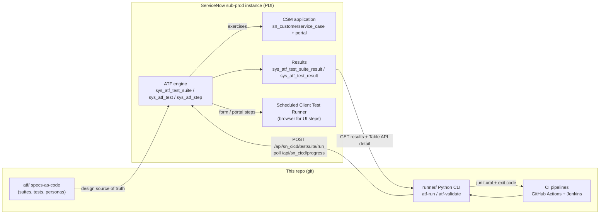

# servicenow-atf

[](https://github.com/dkelle1/gold-ui-test-automation/actions/workflows/servicenow-atf.yml)

A **ServiceNow Automated Test Framework (ATF)** sample: test design specs for the
**Customer Service Management (CSM)** application, an upgrade-regression suite layout, and a small
Python runner that drives ATF suites from CI through ServiceNow's **CI/CD REST API** and turns the
results into JUnit XML.

This framework is the deliberate exception to this repo's saucedemo.com convention: ATF tests are
*records inside a ServiceNow instance*, executed *by the platform itself*, so the system under test is
a ServiceNow instance (a free [Personal Developer Instance](https://developer.servicenow.com/)) rather
than a public demo website. Everything that *can* live in git does: test design specs, the CI glue,
the pipelines, and the docs. The scope is modelled on a real *Senior QA Automation Engineer
(ServiceNow ATF + CSM)* job spec: very good ATF knowledge, CSM functional coverage, upgrade/regression
testing, and CI/CD integration.

## What is in here

| Piece | Where | What it shows |
|---|---|---|
| Architecture schema | [`docs/architecture.md`](docs/architecture.md) | Instance landscape, the ATF object model (`sys_atf_*`), CI/CD run sequence, upgrade-regression flow — all as Mermaid diagrams GitHub renders inline |
| Test design | [`docs/test-design.md`](docs/test-design.md) | Suite strategy (smoke / regression / upgrade), naming conventions, CSM coverage matrix, impersonation matrix, data & rollback strategy, ATF do's and don'ts |
| ATF specs-as-code | [`atf/`](atf/) | YAML source-of-truth for every suite, test, and persona — reviewable in a PR the way ATF's in-instance records never are |
| CI runner | [`runner/`](runner/) | `atf-run` CLI: triggers a suite via `POST /api/sn_cicd/testsuite/run`, polls progress, fetches rolled-up + per-test results, writes JUnit XML, sets the exit code |
| Spec gate | [`runner/src/atf_runner/validate_specs.py`](runner/src/atf_runner/validate_specs.py) | `atf-validate` CLI: schema/consistency checks for the YAML specs, run on every PR |
| Pipelines | [`../.github/workflows/servicenow-atf.yml`](../.github/workflows/servicenow-atf.yml), [`Jenkinsfile`](Jenkinsfile) | PR validation without an instance; on-demand live ATF suite runs with instance credentials |

## Why specs-as-code for a no-code framework

ATF tests are built in the ServiceNow UI and stored as records (`sys_atf_test`, `sys_atf_step`), not
as text — so by default they are invisible to code review, diffing, and pull requests. The pattern
used here is the one mature ServiceNow QA teams converge on:

1. **YAML specs in git are the source of truth for *design***: what each test asserts, step by step,
   with stable keys (`CSM-SMK-001`). They are what gets reviewed in a PR.
2. **The instance holds the executable artifacts**: tests built (or copied from ServiceNow's
   *quick start tests*) to match the specs, exported as **update sets** per release for traceability —
   see [`atf/update-sets/README.md`](atf/update-sets/README.md).
3. **CI validates the specs** (schema, unique keys, suite membership, personas) on every PR, and can
   **execute the real suites** in the instance on demand via the CI/CD REST API.

## Stack

| Concern | Choice |
|---|---|
| System under test | ServiceNow (free Personal Developer Instance), **CSM** application (`com.sn_customerservice`) |
| Test engine | ServiceNow **ATF** — in-instance, no-code steps + `Run Server Side Script` (JavaScript) where needed |
| UI execution | ATF Client Test Runner (a pinned browser tab) or a Scheduled Client Test Runner / Cloud Runner for unattended runs |
| CI trigger | ServiceNow **CI/CD REST API** (`/api/sn_cicd/testsuite/run` → progress → results) |
| CI glue | Python 3.11, `requests`, zero framework magic — see [`runner/`](runner/) |
| Reporting | JUnit XML in CI (PR annotation + artifacts); full drill-down natively in-instance (`sys_atf_test_suite_result`) |
| Package management | [uv](https://docs.astral.sh/uv/) |
| Lint / format / types | ruff + mypy (`strict = true`), same bar as the Python sibling framework |
| CI | GitHub Actions (primary) + Jenkinsfile (secondary) |

## Architecture at a glance



The full schema set — instance landscape, ATF object model, CI/CD sequence diagram, and the upgrade
regression flow — lives in [`docs/architecture.md`](docs/architecture.md).

## Prerequisites

- A ServiceNow instance you may test against — a free
  [Personal Developer Instance (PDI)](https://developer.servicenow.com/dev.do) is enough. **Never run
  ATF on production**: leave `sn_atf.runner.enabled` at `false` there (its default).
- On that instance (one-time setup, detailed in
  [`docs/architecture.md#instance-setup`](docs/architecture.md#instance-setup)):
  - CSM plugin (`com.sn_customerservice`) activated,
  - `sn_atf.runner.enabled` = `true` (and `sn_atf.schedule.enabled` = `true` for scheduled runs),
  - the ATF personas from [`atf/personas.yaml`](atf/personas.yaml) created as users,
  - a CI service account with the CI/CD API + ATF roles,
  - suites/tests built to match the specs in [`atf/`](atf/) (start from ServiceNow's CSM
    *quick start tests* — copy, never edit the shipped ones).
- Locally: Python 3.11+ and [uv](https://docs.astral.sh/uv/getting-started/installation/).

## Quick start

```bash
cd servicenow-atf

# 1. Validate the specs (no instance needed - this is what PR CI runs)
uv sync --locked --project runner
scripts/validate.sh                    # or scripts\validate.ps1 on Windows

# 2. Run a live ATF suite in your instance (needs credentials)
cp .env.example .env                   # fill in SN_INSTANCE_URL / SN_USERNAME / SN_PASSWORD
set -a; . ./.env; set +a
scripts/run-suite.sh "[CSM] Smoke"     # or scripts\run-suite.ps1 "[CSM] Smoke"
```

`run-suite.sh` wraps the `atf-run` CLI; everything it does can be called directly:

```bash
uv run --project runner atf-run \
  --suite "[CSM] Smoke" \
  --junit-out artifacts/atf-junit.xml \
  --poll-interval 15 --timeout 3600
```

Exit codes: `0` all tests passed, `1` the suite ran but has failures, `2` execution/configuration
error (bad credentials, timeout, canceled run). Per-test detail in the JUnit file comes from a Table
API read of `sys_atf_test_result`; if the service account can't read that table the runner degrades
gracefully to the rolled-up counts (`--no-per-test` skips the attempt entirely).

## Configuration

Credentials are environment variables only — never files in git:

| Env var | Meaning | Example |
|---|---|---|
| `SN_INSTANCE_URL` | Instance base URL | `https://dev123456.service-now.com` |
| `SN_USERNAME` | CI service account | `atf.ci` |
| `SN_PASSWORD` | Its password | — |

The service account needs the CI/CD API automation role (`sn_cicd.sys_ci_automation`) plus ATF
execution rights (`atf_test_admin`) — role names as of current releases; verify against your
instance's release notes. See the security section of
[`docs/architecture.md`](docs/architecture.md#roles--security).

## Running in CI

- **GitHub Actions**: [`.github/workflows/servicenow-atf.yml`](../.github/workflows/servicenow-atf.yml)
  - `validate` job on every push/PR touching this folder: ruff, mypy, the runner's unit tests
    (HTTP layer fully mocked — no instance involved), and `atf-validate` over the specs. One of the
    unit tests validates the *shipped* specs, so a broken YAML spec fails the PR twice over.
  - `atf-run` job on `workflow_dispatch` only: takes a suite name, reads
    `SN_INSTANCE_URL`/`SN_USERNAME`/`SN_PASSWORD` from repo secrets, runs the live suite, uploads
    the JUnit artifact, annotates the run, and writes a Markdown summary with the in-instance
    result link. Nightly *regression* is deliberately **not** a CI cron: unattended runs are
    scheduled in-instance (`sys_atf_schedule`) where the platform owns runner availability — CI
    is for on-demand and pre-upgrade gates.
- **Jenkins**: [`Jenkinsfile`](Jenkinsfile) — same two phases; the live run is opt-in via the
  `RUN_ATF` parameter with a `servicenow-atf-ci` username/password credential and a
  `servicenow-instance-url` secret text credential.

## Layout

```
servicenow-atf/
├── atf/                    # specs-as-code: the reviewable source of truth
│   ├── personas.yaml       # ATF impersonation users + roles (the impersonation matrix)
│   ├── suites/             # one YAML per ATF suite (smoke / regression / upgrade)
│   ├── tests/csm/          # one YAML per ATF test, keyed CSM-SMK-### / CSM-REG-###
│   └── update-sets/        # how executable ATF records travel between instances (README)
├── docs/
│   ├── architecture.md     # the schemas: platform, ATF object model, CI/CD, upgrade flow
│   └── test-design.md      # suite strategy, naming, CSM coverage + impersonation matrices
├── runner/                 # uv-managed Python project: atf-run + atf-validate CLIs
│   ├── src/atf_runner/
│   └── tests/              # unit tests, HTTP mocked with `responses`
├── scripts/                # thin wrappers: validate.{sh,ps1}, run-suite.{sh,ps1}
├── .env.example
└── Jenkinsfile
```

## What this deliberately does not do

- **No Selenium/Playwright against the ServiceNow UI.** ATF is the platform-native tool and the whole
  point of this sample; the other frameworks in this repo already demonstrate browser automation.
  Where ATF genuinely runs out (cross-application E2E beyond ServiceNow, email rendering, non-ATF UIs),
  the right move is a hybrid — that boundary is drawn explicitly in
  [`docs/test-design.md`](docs/test-design.md#where-atf-stops).
- **No fake update-set XML.** Update sets are instance exports; committing hand-written ones would be
  noise. The workflow for real exports is documented in [`atf/update-sets/README.md`](atf/update-sets/README.md).
- **No credentials, ever.** `.env` is git-ignored; CI uses repo secrets / Jenkins credentials.
