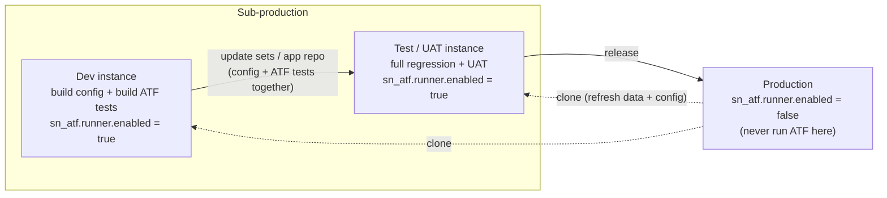
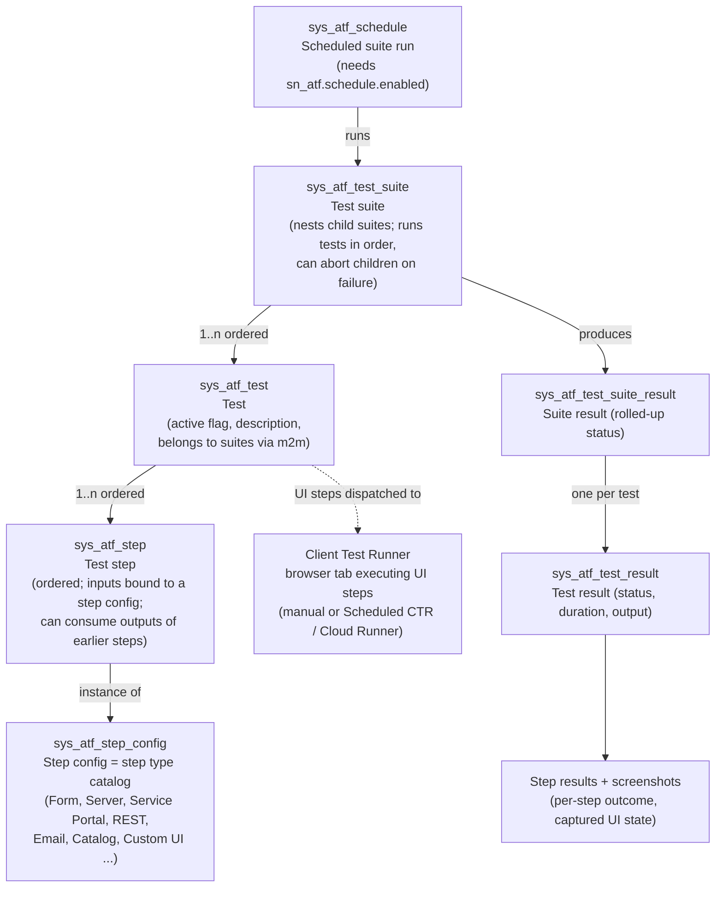
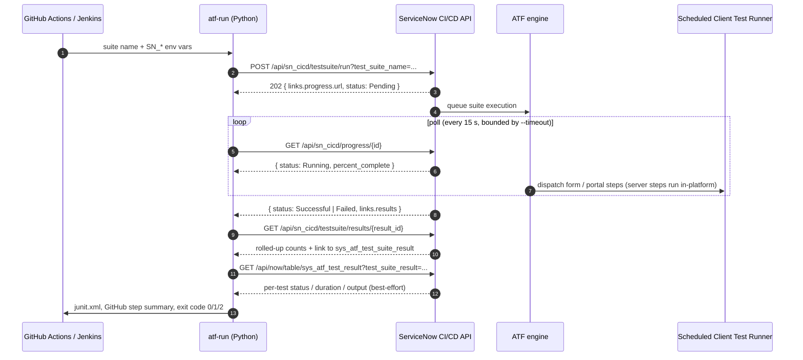
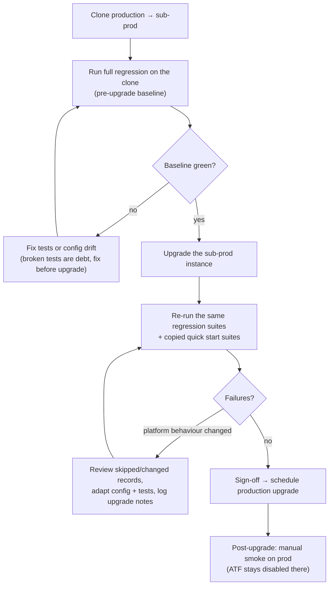

# Architecture

Four schemas, top-down: where ATF sits in a ServiceNow instance landscape, what ATF itself is made
of, how CI drives it end to end, and the upgrade-regression flow that is ATF's primary reason to
exist. Table/property/role names are as of current ServiceNow releases (Xanadu/Yokohama era) — always
verify against your instance's docs, since ATF gains step types and runner options nearly every
release.

## 1. Instance landscape — where ATF runs (and where it must not)

ATF executes *inside* an instance and mutates data while doing so (then rolls it back). The
non-negotiable rule: **ATF never runs on production**. `sn_atf.runner.enabled` is `false` by default
on every instance precisely so that enabling it is a conscious, sub-prod-only decision.

Two things worth calling out:

- **ATF tests travel with the configuration they cover.** A new assignment rule and the ATF test
  that proves it ship in the same update set / scoped app version. That is what makes the test suite
  trustworthy on the *next* instance up the chain — and it's why the specs in [`../atf/`](../atf/)
  are keyed and versioned like code.
- **Clones flow the other way.** Before an upgrade or a big release you clone production onto
  sub-prod, then run the regression suites against real-shaped data. ATF's automatic rollback keeps
  those runs repeatable (§4).

## 2. ATF object model — what a "test" actually is

ATF stores everything as records. Understanding this schema is what separates "I clicked New Test"
from being able to design, review, and bulk-manage a real suite.

Key mechanics the design in [`test-design.md`](test-design.md) leans on:

| Mechanic | What it means in practice |
|---|---|
| **Step configs are the vocabulary** | Steps like `Open a New Form`, `Set Field Values`, `Submit a Form`, `Record Validation`, `Record Insert`, `Record Query`, `Impersonate`, `Run Server Side Script` are picked from `sys_atf_step_config`. New releases add configs; custom ones are possible but a last resort. |
| **Step outputs chain** | A form/insert step exposes the created `record_id`; later steps (e.g. `Record Validation`, `Open an Existing Record`) bind to it. This is ATF's variable passing — no globals. |
| **Server vs client steps** | Server steps run in the platform (no browser at all — fast, runner-independent). Form/portal steps need a Client Test Runner browser. Suites mixing both still need a runner. Prefer server steps for setup to keep UI tests short. |
| **Automatic rollback** | After a test finishes, ATF reverts the data changes the test made (inserts/updates/deletes it tracked). Caveat: work done by *asynchronous* jobs the test triggered may fall outside the rollback — design tests to assert synchronously. |
| **Impersonation** | The `Impersonate` step switches the executing user, so role/ACL behaviour is testable per persona (see [`../atf/personas.yaml`](../atf/personas.yaml)). |
| **Parameterized tests** | One test definition, a grid of input rows — each row executes as its own result. Used sparingly (choice-list sweeps like priority), not as a data-driven crutch. |
| **Quick start tests** | ServiceNow ships ready-made suites per application (CSM included). They are the baseline for upgrade smoke — but **copy** them and adapt the copies; never edit the shipped records, which upgrades overwrite. |

## 3. CI/CD integration — driving ATF from a pipeline

ServiceNow exposes ATF through the CI/CD REST API. The [`runner/`](../runner/) CLI is a thin,
honest client for exactly this sequence:

Design decisions embodied in the runner:

- **Progress `Failed` is not an error.** A suite whose tests fail ends its progress record `Failed`
  but still has results — the runner distinguishes "ran with failures" (exit `1`, JUnit shows which)
  from "couldn't run" (exit `2`: timeout, canceled, auth, no results link).
- **Rolled-up counts arrive as strings** (`"rolled_up_test_failure_count": "2"`) — parsed
  defensively.
- **Per-test detail is enrichment, not a dependency.** The Table API read of `sys_atf_test_result`
  gives JUnit real test cases; if the service account lacks read access (least-privilege setups) the
  runner logs it and falls back to a single rolled-up JUnit case rather than failing the build on a
  reporting nicety.
- **UI-step suites need a live runner.** For unattended CI runs, keep a Scheduled Client Test Runner
  open against the instance (or use Cloud Runner where available). A suite stuck `Pending`/`Waiting`
  with no runner online is the classic first-week failure mode — the runner's timeout turns it into
  a clear exit-2 instead of a hung pipeline.
- **Where the cron lives.** Nightly full regression is scheduled *in-instance* (`sys_atf_schedule`),
  not in CI: the platform owns runner availability and result retention. CI owns *gates*:
  PR validation (specs), and on-demand/pre-upgrade suite runs where the pipeline needs the verdict.

## 4. Upgrade regression — ATF's primary job

The single strongest business case for ATF (and the reason it headlines upgrade-focused QA roles):
making ServiceNow's twice-yearly family upgrades and monthly patches boring.

The [`[Platform] Upgrade regression`](../atf/suites/platform-upgrade.suite.yaml) suite exists for
exactly this: it nests the CSM smoke + regression suites (plus copied quick-start suites per active
application) so "run the upgrade gate" is one suite name — one `atf-run` invocation, one verdict.

## Instance setup

One-time setup on the sub-prod instance (a free PDI works for the whole flow):

1. **Activate CSM**: plugin `com.sn_customerservice` (Customer Service Management), which brings
   `sn_customerservice_case`, accounts/contacts, and the CSM portal.
2. **Allow ATF execution**: system properties `sn_atf.runner.enabled` = `true`, and
   `sn_atf.schedule.enabled` = `true` if you'll use `sys_atf_schedule`.
3. **Create personas**: the users in [`../atf/personas.yaml`](../atf/personas.yaml) with exactly the
   roles listed — the impersonation matrix depends on them being *minimal*.
4. **Create the CI service account** (see below), used only by pipelines.
5. **Build the suites/tests** to match [`../atf/`](../atf/) — fastest path is copying the CSM quick
   start tests and adapting the copies; keep display names and keys in sync with the specs.
6. **Open a Client Test Runner** (Automated Test Framework → Run → Client Test Runner) for form/portal
   steps — or set up a Scheduled Client Test Runner for unattended runs.

## Roles & security

| Account | Roles | Used for |
|---|---|---|
| CI service account (`atf.ci`) | `sn_cicd.sys_ci_automation` + `atf_test_admin` | Triggering suites + reading results via REST. Basic auth from CI secrets; rotate like any service credential. |
| Test designers | `atf_test_designer` (or `atf_test_admin`) | Building/maintaining tests in-instance. |
| Personas (`atf.csm.*`) | Only the CSM roles under test — see [`../atf/personas.yaml`](../atf/personas.yaml) | `Impersonate` steps. Never give them admin: over-privileged personas silently rot ACL coverage. |

Role names are release-dependent — treat the table as intent and verify against your instance's
documentation. Two hard rules regardless of release: production keeps ATF execution disabled, and the
CI account's credentials exist only in CI secret stores (GitHub repo secrets / Jenkins credentials),
never in git.
