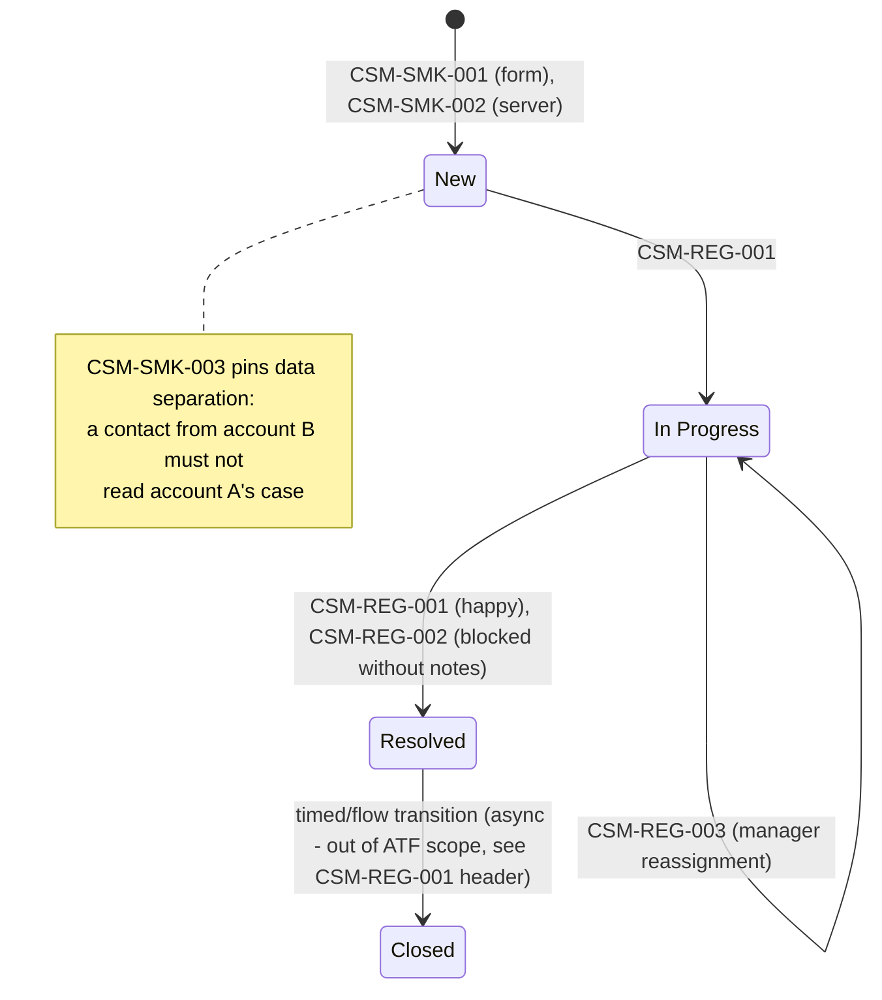

# Test design

How the ATF suites in [`../atf/`](../atf/) are structured and why — the conventions a reviewer needs
to evaluate a spec PR, and the reasoning a new joiner needs to add test #7 without inventing a
parallel style.

## Suite strategy

Three suites, three jobs:

| Suite | Spec | Contents | When it runs |
|---|---|---|---|
| `[CSM] Smoke` | [`csm-smoke.suite.yaml`](../atf/suites/csm-smoke.suite.yaml) | 3 fast tests proving the CSM core is alive: case creation (UI + server), defaulting, data separation | On demand from CI, before/after every deployment to the instance |
| `[CSM] Regression` | [`csm-regression.suite.yaml`](../atf/suites/csm-regression.suite.yaml) | Lifecycle, negative validation, role-based reassignment | Nightly in-instance schedule (`sys_atf_schedule`); pre-release gates |
| `[Platform] Upgrade regression` | [`platform-upgrade.suite.yaml`](../atf/suites/platform-upgrade.suite.yaml) | *Child suites*: smoke + regression, plus copied quick-start suites | The upgrade flow in [`architecture.md §4`](architecture.md#4-upgrade-regression--atfs-primary-job) |

Server-only tests are preferred wherever the behaviour under test isn't literally the UI: they run
without a Client Test Runner, are immune to browser flake, and execute fastest. UI (form/portal)
tests exist to cover what only the UI exhibits — UI policies blocking a submit, portal record
producers, form defaulting.

## Naming

- **Test key**: `CSM-SMK-001` — `<app>-<suite tag>-<seq>`. Stable forever; referenced by suites,
  update-set notes, and defect reports. The YAML filename starts with the key.
- **Display name** (in-instance and in `name:`): `[CSM][Smoke] Agent creates a case from the form` —
  bracketed facets first so the flat in-instance test list groups visually.
- **Personas**: `atf.csm.<role>` users (see [`../atf/personas.yaml`](../atf/personas.yaml)), created
  only for ATF, never real people — impersonating a real user entangles tests with profile drift.

## CSM coverage matrix

The case lifecycle is the spine of CSM; every state transition worth money has a test pinned to it:

| Key | Kind | Persona | Pins down |
|---|---|---|---|
| [`CSM-SMK-001`](../atf/tests/csm/CSM-SMK-001-agent-creates-case-from-form.yaml) | form | `atf.csm.agent` | Agent case creation via the platform form; new-case defaults (`state=New`, `active=true`, `CS`-prefixed number) |
| [`CSM-SMK-002`](../atf/tests/csm/CSM-SMK-002-server-side-case-defaults.yaml) | server | (system) | Same defaults hold for API/integration-created cases — no UI in the loop |
| [`CSM-SMK-003`](../atf/tests/csm/CSM-SMK-003-customer-sees-only-own-cases.yaml) | server | `atf.csm.customer` | ACL/data separation: a contact of another account cannot read the case |
| [`CSM-REG-001`](../atf/tests/csm/CSM-REG-001-case-lifecycle-resolve.yaml) | form | `atf.csm.agent` | Work → resolve happy path; resolution stamps (`close_notes`, resolved fields) |
| [`CSM-REG-002`](../atf/tests/csm/CSM-REG-002-resolution-requires-notes.yaml) | form | `atf.csm.agent` | Negative: resolving without resolution notes is blocked by the form |
| [`CSM-REG-003`](../atf/tests/csm/CSM-REG-003-manager-reassigns-case.yaml) | form | `atf.csm.manager` | Manager-only reassignment; the role boundary between agent and manager |

Coverage grows along two axes, in this order: more lifecycle edges (on-hold reasons, reopen,
cancellation), then more channels (portal record producer, email-to-case, REST case creation) —
channels multiply setup cost, edges don't.

## Impersonation matrix

ACL and UI-policy behaviour is *per role*, so tests declare their persona explicitly and personas
carry the **minimum** roles for their part:

| Persona | Roles | Exists to prove |
|---|---|---|
| `atf.csm.agent` | `sn_customerservice_agent` | What an agent can do (and implicitly, what they can't) |
| `atf.csm.manager` | `sn_customerservice_manager` | Manager-only actions (reassignment, oversight) |
| `atf.csm.customer` | `sn_customerservice.customer` (contact of the *other* account) | The outside boundary: portal-only access, own-account data only |

Over-privileging a persona is the classic silent failure: the test keeps passing while the ACL it
was guarding regresses. Persona role lists live in [`../atf/personas.yaml`](../atf/personas.yaml)
and are validated against every test's `impersonate:` field by `atf-validate`.

## Test data & rollback

- **Each test creates what it asserts on.** Accounts, contacts, and cases are inserted by the test's
  own setup steps (server-side `Record Insert` — fast, runner-free), so tests never depend on
  instance data that a clone refresh will vaporize. ATF's automatic rollback deletes it all
  afterwards.
- **Reference by data the test made.** Later steps bind to earlier steps' outputs (the created
  `record_id`), not to hardcoded sys_ids — specs mark these bindings explicitly
  (`from_step: <order>`).
- **The rollback caveat**: changes made by asynchronous jobs a test triggers (events, async flows)
  can escape rollback and aren't reliably assertable mid-test either. Tests here assert only
  synchronous outcomes; async behaviour (SLAs firing, auto-close after N days) belongs to
  flow-level verification on a dedicated instance, not per-run ATF assertions.
- **Choice values by label.** Specs write display labels (`state: "Resolved"`) rather than backend
  values — readable in review, and the in-instance builder picks from the same labels. Backend
  values differ across releases/customizations; the instance, not the spec, owns them.

## ATF do's and don'ts baked into these specs

- **Do** copy quick start tests; **don't** edit the shipped ones (upgrades overwrite them and your
  changes evaporate).
- **Do** keep one behaviour per test — a failed `CSM-REG-002` means exactly one thing. **Don't**
  chain a whole day-in-the-life into one 40-step test; step 37's failure tells you nothing.
- **Do** use `Run Server Side Script` for assertions no step config covers (it's where the
  JavaScript/Glide knowledge shows) — **don't** use it to *do* things steps exist for; script-heavy
  ATF is Selenium with worse tooling.
- **Do** let suites abort on smoke failure (a dead instance doesn't need 40 more red tests);
  **don't** make regression tests order-dependent on each other — every test builds its own world.
- **Do** keep tests `active=false` only with a linked reason (defect/change); an inactive test with
  no paper trail is deleted coverage.

## Where ATF stops

Honest boundaries, because "ATF for everything" is how platforms get untestable corners:

| Beyond ATF | Right tool |
|---|---|
| Cross-system E2E (ServiceNow ↔ external CRM/ERP) | API-level contract tests + a thin browser E2E (see this repo's Playwright/Selenium siblings) |
| Email rendering, notification content at the client | Mailbox-level checks outside the platform |
| Load/performance | Not a functional-ATF concern at all |
| Pixel-level UI regression | Screenshot tooling outside ATF; ATF asserts state, not pixels |

The specs-as-code layer is what keeps a future hybrid coherent: the same keys and personas extend to
whatever executes the check.
